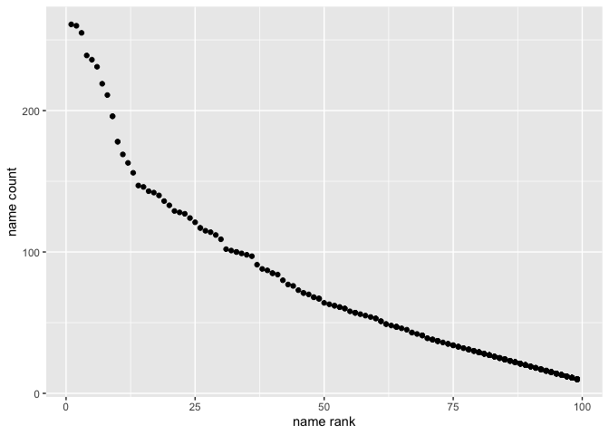

Homework 2
================
Teshawna Badu
10/09/2021

I’m an R Markdown document!

``` r
library(tidyverse)
```

    ## ── Attaching packages ─────────────────────────────────────── tidyverse 1.3.1 ──

    ## ✓ ggplot2 3.3.5     ✓ purrr   0.3.4
    ## ✓ tibble  3.1.4     ✓ dplyr   1.0.7
    ## ✓ tidyr   1.1.3     ✓ stringr 1.4.0
    ## ✓ readr   2.0.1     ✓ forcats 0.5.1

    ## ── Conflicts ────────────────────────────────────────── tidyverse_conflicts() ──
    ## x dplyr::filter() masks stats::filter()
    ## x dplyr::lag()    masks stats::lag()

``` r
library(readxl)
library(readr)
library(dplyr)
```

Download the trashwheel dataset

``` r
trashwheel_df = 
  readxl::read_excel("TrashWheelCollection.xlsx",
  sheet = "MrTrashWheel", range = "A2:N535") %>% 
  janitor::clean_names() %>% 
  mutate(sports_balls = round(sports_balls),
  sports_balls = as.integer(sports_balls)) %>% 
  drop_na(dumpster)
```

# Problem 1: 2018 and 2019 precipitation data

``` r
precip_18 = 
  readxl::read_excel("TrashWheelCollection.xlsx",
  sheet = "2018 Precipitation", skip = 1) %>% 
  janitor::clean_names() %>%
  drop_na(month) %>% 
  mutate(year = 2018) %>% 
  relocate(year)


precip_19 = 
  readxl::read_excel("TrashWheelCollection.xlsx",
  sheet = "2019 Precipitation", skip = 1) %>% 
  janitor::clean_names() %>%
  drop_na(month) %>% 
  mutate(year = 2019) %>% 
  relocate(year)
```

# Combining annual precipitation

``` r
month_df = 
  tibble(
    month = 1:12,
    month_name = month.name
  )

Precipitation_df = 
  bind_rows(precip_19, precip_18)

left_join(Precipitation_df, month_df, by = "month")
```

    ## # A tibble: 24 × 4
    ##     year month total month_name
    ##    <dbl> <dbl> <dbl> <chr>     
    ##  1  2019     1  3.1  January   
    ##  2  2019     2  3.64 February  
    ##  3  2019     3  4.47 March     
    ##  4  2019     4  1.46 April     
    ##  5  2019     5  3.58 May       
    ##  6  2019     6  0.42 June      
    ##  7  2019     7  3.85 July      
    ##  8  2019     8  2.39 August    
    ##  9  2019     9  0.16 September 
    ## 10  2019    10  5.45 October   
    ## # … with 14 more rows

``` r
summary(Precipitation_df)
```

    ##       year          month           total       
    ##  Min.   :2018   Min.   : 1.00   Min.   : 0.160  
    ##  1st Qu.:2018   1st Qu.: 3.75   1st Qu.: 2.322  
    ##  Median :2018   Median : 6.50   Median : 3.745  
    ##  Mean   :2018   Mean   : 6.50   Mean   : 4.345  
    ##  3rd Qu.:2019   3rd Qu.: 9.25   3rd Qu.: 5.615  
    ##  Max.   :2019   Max.   :12.00   Max.   :10.470

The Mr. Trash Wheel is a water wheel trash collector located in Inner
Harbor in Baltimore, Maryland. The data in this dataset includes year,
month, total. The size of dataset we have is 72.The total precipitation
in 2018 is 70.33. The median number of sports balls in a dumpster in
2019 is 9.

# Problem 2

# clean pols-month

``` r
pols_df = read_csv("./FiveThirtyEight/pols-month.csv") %>% 
 janitor::clean_names() %>% 
  separate(mon, into = c("year", "month", "day"), convert = T) %>% 
  mutate(month = month.name[month],
         president = recode(prez_gop, `0` = "dem", `1` = "gop", `2` = "gop")) %>%
  select(-day, -starts_with("prez"))
```

    ## Rows: 822 Columns: 9

    ## ── Column specification ────────────────────────────────────────────────────────
    ## Delimiter: ","
    ## dbl  (8): prez_gop, gov_gop, sen_gop, rep_gop, prez_dem, gov_dem, sen_dem, r...
    ## date (1): mon

    ## 
    ## ℹ Use `spec()` to retrieve the full column specification for this data.
    ## ℹ Specify the column types or set `show_col_types = FALSE` to quiet this message.

# clean snp

``` r
snp_path = "./FiveThirtyEight/snp.csv"

my_parse_date = function(date){
  date = parse_date(date, format = '%m/%d/%y')
  date[format(date, "%y") >= 50] = parse_date(format(date[format(date, "%y") >= 50], "19%y-%m-%d"))
  return(date)
}
snp_df =
read_csv(snp_path) %>% 
janitor::clean_names() %>% 
mutate(date = my_parse_date(date)) %>% 
separate(date, into = c("year", "month", "day"), convert = TRUE) %>% 
arrange(year, month) %>% 
mutate(month = month.name[month]) %>% 
relocate(year, month) %>% 
select(-day)
```

    ## Rows: 787 Columns: 2

    ## ── Column specification ────────────────────────────────────────────────────────
    ## Delimiter: ","
    ## chr (1): date
    ## dbl (1): close

    ## 
    ## ℹ Use `spec()` to retrieve the full column specification for this data.
    ## ℹ Specify the column types or set `show_col_types = FALSE` to quiet this message.

# clean unemployment

``` r
unemploy_path = "./FiveThirtyEight/unemployment.csv"
month_dict = month.name
names(month_dict) = month.abb

unemploy_df = 
  read_csv(unemploy_path) %>%
  pivot_longer(cols = "Jan":"Dec", names_to = "month", values_to = "unemployment_rate") %>% 
  mutate(month = as.character(month_dict[month])) %>% 
  janitor::clean_names()
```

    ## Rows: 68 Columns: 13

    ## ── Column specification ────────────────────────────────────────────────────────
    ## Delimiter: ","
    ## dbl (13): Year, Jan, Feb, Mar, Apr, May, Jun, Jul, Aug, Sep, Oct, Nov, Dec

    ## 
    ## ℹ Use `spec()` to retrieve the full column specification for this data.
    ## ℹ Specify the column types or set `show_col_types = FALSE` to quiet this message.

# Merge

``` r
Fivethirty_df = 
  left_join(pols_df, snp_df) %>% 
  left_join(unemploy_df)
```

    ## Joining, by = c("year", "month")
    ## Joining, by = c("year", "month")

The pols-month is a dataset related to the number of national
politicians who are democratic or republican at any given time. The
`pols_df` dataset contains 9 variables and 822 observations. The key
variables includegov\_gop, sen\_gop, rep\_gop, gov\_dem, sen\_dem,
rep\_dem, president, from 1947 to 2015.

Snp is a dataset related to Standard & Poor’s stock market index (S&P).
It contains 3 variables and 787 observations.The key variables include
close, from 1950 to 2015.

The unemployment dataset consists of information related to unemployment
percentage with respect to years and months. It contains 3 variables and
816 observations.The key variables include 3 variables and 816
observations. It provides relevant information of unemployment rate per
month in US by the variableunemployment\_rate from 1948 to 2015.

# Problem 3

``` r
babynames_df = read_csv("Popular_Baby_Names.csv") %>% 
  janitor::clean_names() %>% 
  mutate(
    childs_first_name = str_to_title(childs_first_name),
    ethnicity = str_to_title(ethnicity)
  ) %>% 
  mutate(
    ethnicity = recode(ethnicity, 
       "Asian And Paci" = "Asian And Pacific Islander",
      "Black Non Hisp" = "Black Non Hispanic",
      "White Non Hisp" = "White Non Hispanic"
       )
        ) %>% 
  distinct() %>% 
  arrange(year_of_birth,ethnicity, rank)
```

    ## Rows: 19418 Columns: 6

    ## ── Column specification ────────────────────────────────────────────────────────
    ## Delimiter: ","
    ## chr (3): Gender, Ethnicity, Child's First Name
    ## dbl (3): Year of Birth, Count, Rank

    ## 
    ## ℹ Use `spec()` to retrieve the full column specification for this data.
    ## ℹ Specify the column types or set `show_col_types = FALSE` to quiet this message.

# Next step is to find popularity by Olivia

``` r
babynames_df %>% 
  filter(childs_first_name == "Olivia", gender == "FEMALE") %>% 
  select(year_of_birth, ethnicity, rank) %>% 
  pivot_wider(
    names_from = year_of_birth, 
    values_from = rank)
```

    ## # A tibble: 4 × 7
    ##   ethnicity                  `2011` `2012` `2013` `2014` `2015` `2016`
    ##   <chr>                       <dbl>  <dbl>  <dbl>  <dbl>  <dbl>  <dbl>
    ## 1 Asian And Pacific Islander      4      3      3      1      1      1
    ## 2 Black Non Hispanic             10      8      6      8      4      8
    ## 3 Hispanic                       18     22     22     16     16     13
    ## 4 White Non Hispanic              2      4      1      1      1      1

# Find popularity for male name

``` r
babynames_df %>% 
  filter(gender == "MALE",rank == 1) %>% 
  select(year_of_birth, ethnicity, childs_first_name) %>% 
  pivot_wider(
  names_from = year_of_birth,
  values_from = childs_first_name
  )
```

    ## # A tibble: 4 × 7
    ##   ethnicity                  `2011`  `2012` `2013` `2014` `2015` `2016`
    ##   <chr>                      <chr>   <chr>  <chr>  <chr>  <chr>  <chr> 
    ## 1 Asian And Pacific Islander Ethan   Ryan   Jayden Jayden Jayden Ethan 
    ## 2 Black Non Hispanic         Jayden  Jayden Ethan  Ethan  Noah   Noah  
    ## 3 Hispanic                   Jayden  Jayden Jayden Liam   Liam   Liam  
    ## 4 White Non Hispanic         Michael Joseph David  Joseph David  Joseph

# number of children with a name (y axis) against the rank in popularity of that name (x axis)

``` r
babynames_df %>% 
  filter(
    gender == "MALE",
    ethnicity == "White Non Hispanic",
    year_of_birth == 2016
  ) %>% 
  ggplot(aes(x = rank, y = count)) +
  geom_point() +
  ylab("name count") +
  xlab("name rank")
```

<!-- -->
